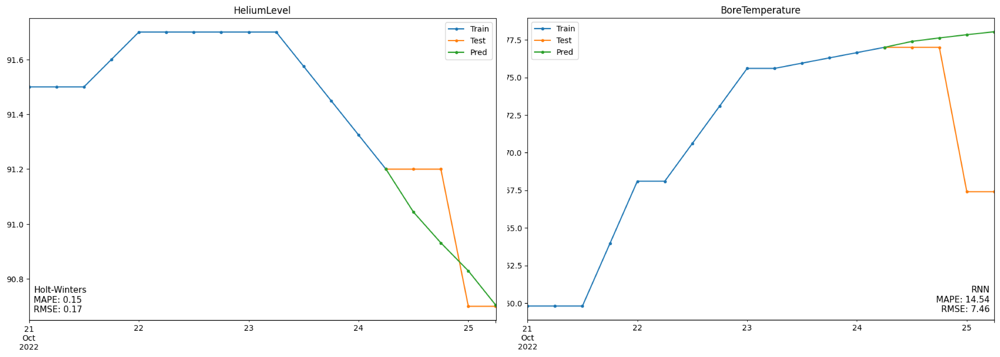
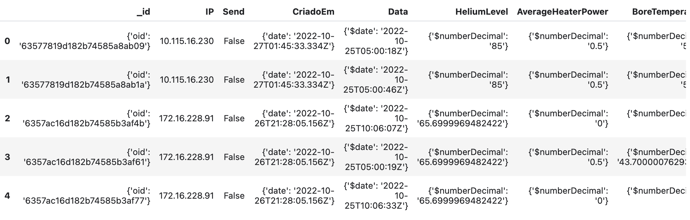
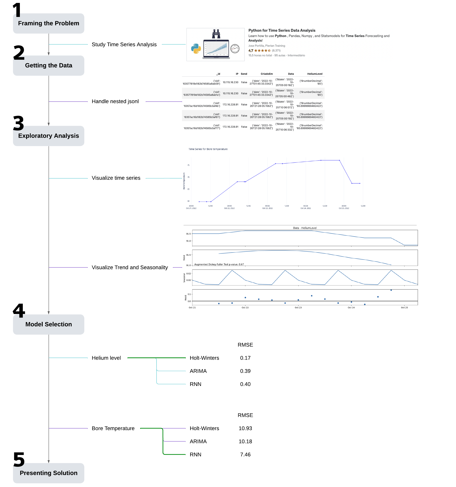

# Time Series Machine Learning - Medical Equipment Sensor

*Predicting time series behavior for sensors in an equipment.*

# 📖 Project

### 👨🏻‍🏫 Introduction

This project is a time series analysis and machine learning modeling to predict the levels of Helium and Bore temperature of a medical equipment. These two measures are essential to check the equipment safety and calibration.

The dataset contains five days of data with measurements distributed over time.

### 🎯 Goal

Explore and apply different machine learning models for time series prediction: Holt-Winters, ARIMA and RNNs.

### 📊 Results

Best performing models achieved an RMSE of **0.17** for Helium level and **7.46** for Bore temperature.

#### Visualizing results

### 📈 Features

# 🗺  Methodology

# 🗄 Notebooks

- [1.0-eda.ipynb](notebooks/1.0-eda.ipynb)
- [2.0-ml_modeling.ipynb](notebooks/2.0-ml_modeling.ipynb)

# 📦 Folder Structure

    ├── LICENSE
    ├── poetry.lock        <- file with poetry packages from the environment
    ├── pyproject.toml     <- file with poetry specifications for the project environment
    ├── README.md          <- The top-level README for developers using this project.
    ├── data
    │   ├── processed      <- The final, canonical data sets for modeling.
    │   └── raw            <- The original, immutable data dump.
    │
    ├── models             <- Trained and serialized models or model summaries
    │
    ├── notebooks          <- Jupyter notebooks. Naming convention is a number (for ordering),
    │                         and a short `-` delimited description, e.g.
    │                         `1.0-initial-data-exploration`.
    │
    ├── references         <- Figures, manuals, and all other explanatory materials.
